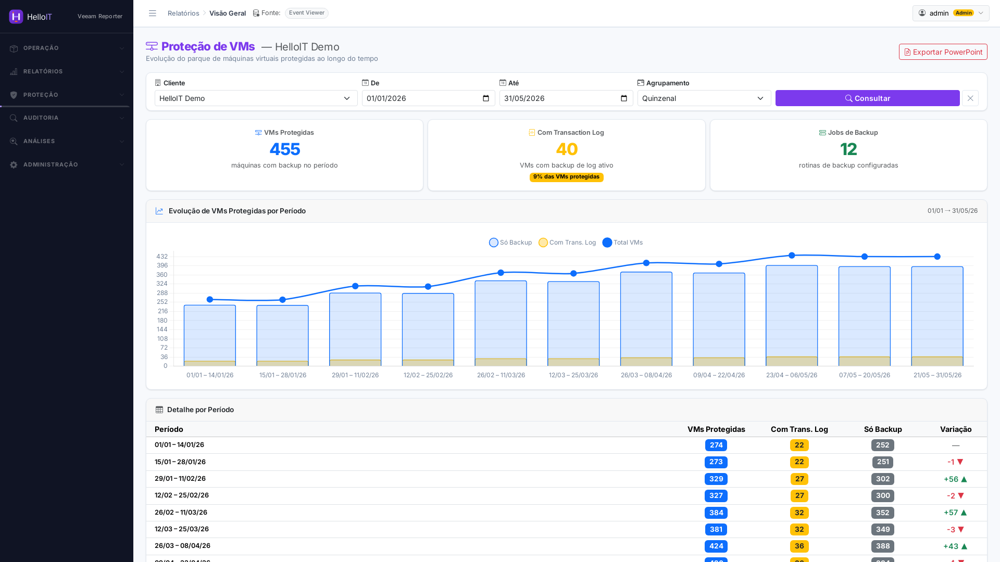
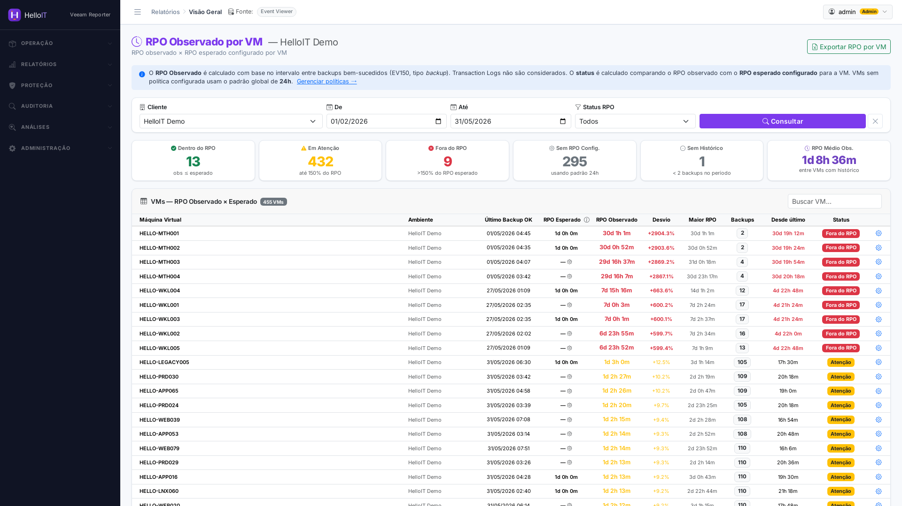

<p align="center">
  <a href="https://helloit.com.br">
    <picture>
      <source media="(prefers-color-scheme: dark)" srcset="app/static/brand/logo-helloit.svg">
      
    </picture>
  </a>
</p>

<h1 align="center">HelloIT Veeam Reporter</h1>

<p align="center">
  Plataforma web para <b>monitoramento e auditoria de backups Veeam</b> —
  relatórios, RPO, offload, uso de disco e config drift, multi-tenant e white-label.
</p>

<p align="center">
  
  
  
  
  
</p>

---

## ✨ O que é

Ingere exportações do **Veeam Backup & Replication** (event logs `.evtx`, CSV/XML e
NDJSON de coletores PowerShell), interpreta sessões de backup/offload, uso de disco e
configuração de rotinas, e entrega **relatórios** e **telas analíticas** por cliente —
com identidade visual configurável por perfil.

## 🚀 Recursos

- 📊 **Relatórios** semanais/mensais (Event Viewer) com exportação **PPTX/Excel**
- 🛡️ **Proteção de VMs / RPO** — cobertura e RPO observado por VM
- ♻️ **Offload / Capacity Tier** — análise de sessões de offload (SOBR)
- ⚡ **Performance de Backup** — duração/velocidade por VM, backups lentos
- 🧭 **Auditoria de Configuração** — schedule, imutabilidade, proxies, GFS, retenção, com **histórico de alterações (config drift)**
- 👥 **Servidores duplicados** e **VMs sem backup**
- 🎨 **Multi-tenant + white-label** — identidade visual por cliente
- 🔒 Coletores PowerShell **somente leitura** (NDJSON)

## 📸 Screenshots

**Proteção de VMs** — evolução do parque protegido, com e sem transaction log



**RPO Observado por VM** — RPO real × esperado, com status por máquina



<sub>Dados fictícios de demonstração.</sub>

## ⚡ Quickstart

```bash
git clone https://github.com/eduardohelloit/helloit-veeam-reporter.git
cd helloit-veeam-reporter
cp .env.example .env && chmod 600 .env   # defina POSTGRES_PASSWORD e ADMIN_PASSWORD
sudo docker compose build && sudo docker compose up -d
```
Acesse `https://SEU_SERVIDOR/` (TLS self-signed). Guia completo em **[INSTALL.md](INSTALL.md)**.

## 🧱 Arquitetura

FastAPI + Uvicorn (Python 3.11) · PostgreSQL 16 · SQLAlchemy 2 + Alembic · Docker Compose.
Detalhes em **[ARCHITECTURE.md](ARCHITECTURE.md)**.

## 🗺️ Roadmap

Veja **[ROADMAP.md](ROADMAP.md)**.

## ☕ Apoie o projeto

Se este projeto te ajuda, considere apoiar o desenvolvimento:

> **PIX:** `apoie@helloit.com.br`
>
> <!-- QR code opcional: salve em docs/pix-qr.png e descomente:
>  -->

Qualquer valor ajuda a manter o projeto evoluindo. 🙏

## 🤝 Contribuindo

Contribuições são bem-vindas! Veja **[CONTRIBUTING.md](CONTRIBUTING.md)**.

## 📄 Licença

[MIT](LICENSE) © 2026 HelloIT
